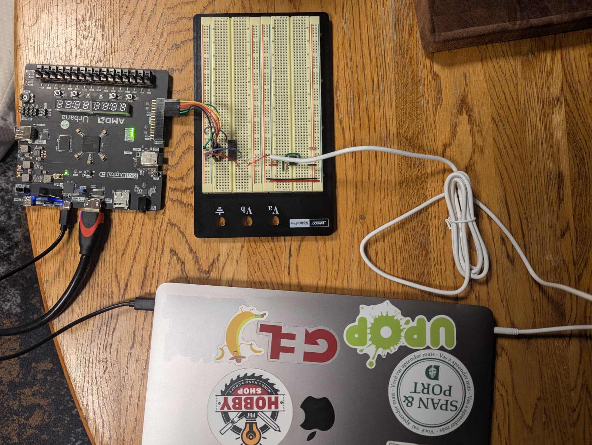

## what it is:
my attempt at making a basic electrocardiogram (EKG) setup on an FPGA

the FPGA handles the digital signal coming in by using an SPI ADC to sample the 
data at roughly 500 Hz (standard for EKG). in `top_level.sv`, this shows up as a
sample_trigger that goes high every 150_000th clock cycle on a 74.25 MHz clock

then the individual electrode signals are resolved into leads (just subtraction)

this data is then passed to an FIR filter implemented as a 40-tap moving average.
this is definitely not standard for EKGs but its able to (roughly) show the idea
of what i'm doing

the filtered data is then just passed out to the scrolling graph to be displayed
by HDMI

## the diagram:

## the actual setup and demo:
i didn't have any actual electrodes that i could stick on my body so i used a
single-ended headphone jack to pass in `simulated_ecg.wav`[^1] which is supposed 
to replace both the left and right bicep leads (in my case). this means the 
subtraction step is skipped (you'll see that in `top_level.sv`)

<video width="320" height="240" controls>
  <source src="rsc/demo.mp4" type="video/mp4">
</video>
(hopefully your actual ekg will never look like this...)

[^1]: generated by Claude's Sonnet 4.0 model on 7 Sep 2025
